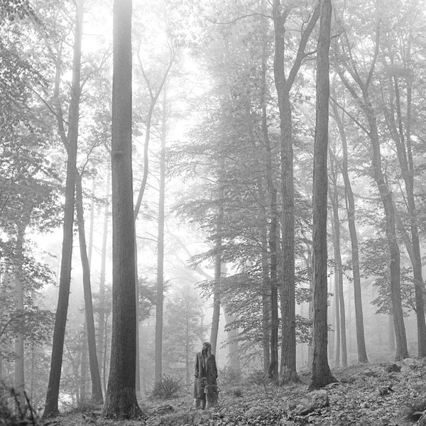

# folklore-lyrics

lyrics of 16 songs: https://genius.com/albums/Taylor-swift/Folklore

every other letter on the album being lowercase

1. analyze folklore 
2. compare folklore with other albums 

https://github.com/aaumaitre/taylor_swift
https://rpubs.com/RosieB/taylorswiftlyricanalysis
https://www.promptcloud.com/blog/data-visualization-text-mining-taylor-swift-song-lyrics/
https://news.codecademy.com/taylor-swift-lyrics-machine-learning/
https://www.kaggle.com/PromptCloudHQ/taylor-swift-song-lyrics-from-all-the-albums/data?select=taylor_swift_lyrics.csv
lyrics generator: https://www.kaggle.com/modmari/taylor-swift-s-song-lyrics-generator

https://towardsdatascience.com/detecting-bad-customer-reviews-with-nlp-d8b36134dc7e [Detecting bad customer reviews with NLP]
https://medium.com/@chaimgluck1/have-messy-text-data-clean-it-with-simple-lambda-functions-645918fcc2fc
https://medium.com/@s.sinimgba/analysis-of-wizkids-lyrics-3703228f28fc 
topics modelling: https://medium.com/analytics-vidhya/text-mining-101-a-stepwise-introduction-to-topic-modeling-using-latent-semantic-analysis-using-add9c905efd9

